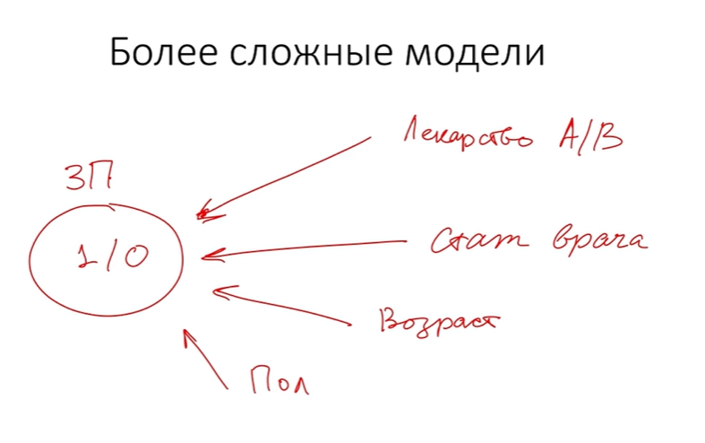

[Конспект](https://colab.research.google.com/drive/1n1vPB28X6bXK-weEftyVEdjrsQkWolxI?usp=sharing#scrollTo=Q6a-9ZZD-QKk)

http://www.mathprofi.ru/files/zadachi_dsv.pdf

[Конспект на юпитере Гитхаб](https://github.com/KlukvaMors/basic_stat/blob/main/%D0%BA%D0%BE%D0%BD%D1%81%D0%BF%D0%B5%D0%BA%D1%82.ipynb)

[Конспект на Юпитере](https://nbviewer.org/github/KlukvaMors/basic_stat/blob/main/%D0%BA%D0%BE%D0%BD%D1%81%D0%BF%D0%B5%D0%BA%D1%82.ipynb)

## Мат статистика

выборка 

репрезентативный, стратифицированная, групповая


вариантов много: номинальная, номинативная, качественная, фактор


## Меры центральной тенденции


## Меры изменчивости

Размах

Дисперсия (отношение суммы квадратов отклонений и количество отклонений)

Среднеквадратичное (стандартное) отклонение - корень из дисперсии


## Квартили распределения и график box-plot

КВАНТиль = квант = quantity = количество

КВАРТиль = кварта = quarter = четверть

2-квантиль = медиана

4-квантиль = квартиль

10-квантиль = дециль

100-квантиль = перцентиль


## Нормальное распределение

https://gallery.shinyapps.io/dist_calc/

> **Унимодальное** распределение - распределение, которое имеет только одну моду.

> **Нормальное распределение** - основополагающее распределение статистики. Его характерными чертами являются унимодальность, симметричность, а также то, что отклонение наблюдений от среднего подчиняется определеннному вероятностному закону - законку нормального распределения. График распредения представлен выше и ниже. На графике можно увидеть, 34.1% наблюдений лежит в пределах от среднего значения до 1σ, 13.6% от 1σ до 1σ и тд. 

**Z-стандартизация** - преобразование нормального распределения, позволяющее сместить математическое ожидание в 0, а дисперсию сделать равной 1.


**Правило σ**:

- В диапазоне Mx±σ лежит около 68% наблюдений.
- В диапазоне Mx±2σ лежит около 95% наблюдений.
- В диапазоне Mx±3σ лежит около 100% наблюдений.


https://www.khanacademy.org/math/ap-statistics/density-curves-normal-distribution-ap/measuring-position/v/z-score-introduction


## Центральная предельная теорема

> **Центральная предельная теорема** - теорема о вычислении оценки стандартного отклонения математического ожидания генеральной совокупности через знание стандартного отклонения наугад взятой выборки, в которой количество членов > 30.

> **Формулировка ЦПТ** - **Стандартная ошибка среднего se** (то как в среднем отклоняются все математические ожидания всех возможных выборок с количеством элементов n от их математического ожидания или иначе говоря, насколько велик разброс математических ожиданий случайных выборок от реального мат. ожидания генеральной совокупности) se равна:
>
> - se=σ√n, где σ− стандартное отклонение генеральной совокупности, n - количество элементов в одной выборке, из общего числа выборок взятых наугад.
> - Но такжем ее можно рассчитать как: se=sdx√n, где sdx− стандартное отклонение наугад взятой выборки, n - количество элементов выборки.
> - *Примечание:* оказывается, что ЦПТ работает не только для нормального распределения, но и для всех остальных тоже. Однако математическое ожидание наугад взятых выборок из любых распределений все равно будет распределено по нормальному закону. И оценку истинного математического ожидания можно дать используя ЦПТ.

> Ссылки по теме:
>
> - [Симуляция предельной теоремы](https://gallery.shinyapps.io/CLT_mean/)


https://www.youtube.com/watch?v=YAlJCEDH2uY

https://www.marketing.spb.ru/lib-around/stat/Naked_Statistics.htm


## Доверительные интервалы для среднего

[Презентация](https://mse.msu.ru/wp-content/uploads/2020/03/%D0%9B%D0%B5%D0%BA%D1%86%D0%B8%D1%8F-5-%D0%B4%D0%BE%D0%B2%D0%B5%D1%80%D0%B8%D1%82%D0%B5%D0%BB%D1%8C%D0%BD%D1%8B%D0%B5-%D0%B8%D0%BD%D1%82%D0%B5%D1%80%D0%B2%D0%B0%D0%BB%D1%8B.pdf)

Исследуя какую-то выборку, мы можем узнать среднее этой выборки. Однако нам больше всего интересно исследовать среднее генеральной совокупности. Возникает вопрос в том как это оценить. Ведь для того чтобы сказать точно потребуется исследовать всю генеральную совокупность, чего сделать невозможно в большинстве случаев. Тогда прибегают к оценке математического ожидания генеральной совокупности.

> Дело в том, что для нормального распределения 95% всех значений лежит в области [Mx−1.96σ;Mx+1.96σ]. Это говорит о том, что выборочное среднее наугад взятой выборки из n>30 значений будет лежать в этом диапазоне с вероятность в 95% процентов от математического ожидания ГС. Также верно и обратное утверждение о том, что Mx ГС лежит в интервале [x¯−1.96σ;x¯+1.96σ] от выборочной средней с вероятностью в 95% процентов.

> Существуют также и другие стандартные интервалы вероятностей:
>
> - Для 95% уровня надежности: Mx∈[x¯−1.96σ;x¯+1.96σ]
> - Для 99% уровня надежности: Mx∈[x¯−2.58σ;x¯+2.58σ]


https://thinkcognitive.org/ru/blog/golova-professora-bambldorfa#.YNnNO-omztQ

[Визуализация CI](https://rpsychologist.com/d3/ci/) 

[Z table](https://www.math.arizona.edu/~rsims/ma464/standardnormaltable.pdf)

[От доверительных интервалов хотят отказаться](https://www.tandfonline.com/doi/full/10.1080/01973533.2015.1012991#abstract)

[Странный тервер - Парадокс Монти Холла](https://ru.wikipedia.org/wiki/%D0%9F%D0%B0%D1%80%D0%B0%D0%B4%D0%BE%D0%BA%D1%81_%D0%9C%D0%BE%D0%BD%D1%82%D0%B8_%D0%A5%D0%BE%D0%BB%D0%BB%D0%B0)


## Идея статистического вывода, p-уровень значимости

p-уровень значимости - это вероятность получить такие или более выраженные различия при условии, что в генеральной совокупности никаких различий на самом деле нет.

> При заключении статистического вывода об исследованиях можно совершить ошибку 1-го и 2-го рода:
>
> - **Ошибка 1-го рода**: Отклонение нулевой гипотезы при том, что она была верна.
> - **Ошибка 2-го рода**: Принятие нулевой гипотезы при том, что она была неверна.


[Что такое p-value на самом деле?]()

[калькулятор p-value](https://gallery.shinyapps.io/dist_calc/)

[Dance of  the p-values](https://www.youtube.com/watch?v=5OL1RqHrZQ8)


## T-распределение

Из книги Статистика для тех кто (думает что) ненавидит статистику


t-критерий Стьюдента — общее название для статистических тестов, в которых статистика критерия имеет распределение Стьюдента. Наиболее часто t-критерии применяются для проверки равенства средних значений в двух выборках. Нулевая гипотеза предполагает, что средние равны (отрицание этого предположения называют гипотезой сдвига). Для применения данного критерия необходимо, чтобы исходные данные имели нормальное распределение.


причем ответ на вопрос, почему верно это равенство, кроется в свойстве дисперсии: дисперсия суммы независимых случайных величин равна сумме их дисперсий. а отклонение - это корень из дисперсии. отсюда ваша последняя формула 

[t-distribution table (two-tailed)](https://www.medcalc.org/manual/t-distribution-table.php)


## Примеры применения t-критерий Стьюдента

**Пример 1.** Первая выборка — это пациенты, которых лечили препаратом А. Вторая выборка — пациенты, которых лечили препаратом Б. Значения в выборках — это некоторая характеристика эффективности лечения (уровень метаболита в крови, температура через три дня после начала лечения, срок выздоровления, число койко-дней, и т.д.) Требуется выяснить, имеется ли значимое различие эффективности препаратов А и Б, или различия являются чисто случайными и объясняются «естественной» дисперсией выбранной характеристики.

**Пример 2.** Первая выборка — это значения некоторой характеристики состояния пациентов, записанные до лечения. Вторая выборка — это значения той же характеристики состояния тех же пациентов, записанные после лечения. Объёмы обеих выборок обязаны совпадать; более того, порядок элементов (в данном случае пациентов) в выборках также обязан совпадать. Такие выборки называются связными. Требуется выяснить, имеется ли значимое отличие в состоянии пациентов до и после лечения, или различия чисто случайны.

**Пример 3.** Первая выборка — это поля, обработанные агротехническим методом А. Вторая выборка — поля, обработанные агротехническим методом Б. Значения в выборках — это урожайность. Требуется выяснить, является ли один из методов эффективнее другого, или различия урожайности обусловлены случайными факторами.

**Пример 4.** Первая выборка — это дни, когда в супермаркете проходила промо-акция типа А (красные ценники со скидкой). Вторая выборка — дни промо-акции типа Б (каждая пятая пачка бесплатно). Значения в выборках — это показатель эффективности промо-акции (объём продаж, либо выручка в рублях). Требуется выяснить, какой из типов промо-акции более эффективен.


**Гомогенность дисперсии можно оценить, используя "Критерий Левена" или "Критерий Фишера**

[Распределения на разных языках](https://documents.pub/document/for-distribution-functions-commonly-used-in-inferential-ericuniv-lyon2frriccotanagrafichiersentanagracalculpvaluepdf.html?page=11)

[Визуализация результатов в R: первые шаги](https://habr.com/ru/company/stepic/blog/260981/)

[О степенях свободы в статистике](https://habr.com/ru/company/stepic/blog/311354/)


## Проверка распределения на нормальность

## QQ-plot


## Однофакторный дисперсионный анализ


## Множественные сравнения в ANOVA

## Многофакторный ANOVA


## АБ тесты и статистика

1. Крутая [книга](https://experimentguide.com/) о том, как спланировать и провести своё первое A/B тестирование
2. [Подборка](https://exp-platform.com/) примеров применения A/B тестов в индустрии: как топовая литература на тему, так и интервью от сотрудников крупных компаний, применяющих A/B тесты в работе
3. Пошаговый, написанный с Никитой в соавторстве [гайдлайн](https://medium.com/@vktech/practitioners-guide-to-statistical-tests-ed2d580ef04f?fbclid=IwAR0Q7Gb-YmHG0Cg28IMC6RdBcjwqM466HaB4c-CtpXd03N-XyNzv9N5sWF0) для создания A/B тестов на языке Python:
4. [Статья](https://research.google/pubs/pub43157/), описывающая как определять, комбинировать и объединять метрики (и комбинации из 2-3 метрик) с высокой прогнозирующей способностью таким образом, чтобы уменьшать их число и снижать вариативность
5. [Работа](https://arxiv.org/abs/1404.7530), рассматривающая различные подходы к планированию и созданию рандомизированных экспериментов, чтобы не получить мнимые отличия на этапе дизайна
6. Краткое [руководство](https://onlineuserengagement.github.io/) как правильно выстроить работу b2c: на какие метрики необходимо смотреть и как их учитывать для улучшения работы


## Понятие корреляции


Разница между **ковариацией** и **корреляцией**: Мера, используемая для указания степени изменения двух случайных переменных в тандеме, называется **ковариацией**. Мера, используемая для представления, насколько сильно связаны две случайные величины, известная как **корреляция**.

Коэффициент **линейной корреляции Пирсона**


Коэффициент принимает значения [-1;1]


Коэффициент корреляции не обеспечивает взимосвязь между двумя переменными не в каком напрвалении, а только показывает их синхронность (понятие ложной корреляции)

Для обнаружения причинно-следственной связи Independent Component Analysis


[Визуализация корреляции](https://rpsychologist.com/correlation/)

[Игра на корреляцию](https://guessthecorrelation.com/)

[Сомнительные графики корреляции](https://www.tylervigen.com/spurious-correlations)


## Условия применения коэффициента корреляции


Опасность выбросов


Коэффициент корреляции Спирмена и коэффициент корреляции тау Кендалла


## Регрессия с одной независимой переменной


## Задача предсказания значений зависимой переменной


## Условия применения линейной регрессии с одним предиктором

- [Слайды уроку формате PDF](https://stepik.org/media/attachments/lesson/8086/%D0%A1%D1%82%D0%B0%D1%82%D0%B8%D1%81%D1%82%D0%B8%D0%BA%D0%B0%20-%20%D0%A3%D1%81%D0%BB%D0%BE%D0%B2%D0%B8%D1%8F%20%D0%BF%D1%80%D0%B8%D0%BC%D0%B5%D0%BD%D0%B5%D0%BD%D0%B8%D1%8F%20%D1%80%D0%B5%D0%B3%D1%80%D0%B5%D1%81%D1%81%D0%B8%D0%B8%20%D1%81%20%D0%BE%D0%B4%D0%BD%D0%BE%D0%B9%20%D0%9D%D0%9F.pdf)
- [Diagnostics for simple linear regression](https://gallery.shinyapps.io/slr_diag/)


**Требования к данным:**

- Линейная взаимосвязь между X и Y;
- Нормальное распределение остатков;
- Гомоскедастичность - постоянная изменчивость остатков на всех уровнях независимой переменной.


## Регрессионный анализ с несколькими независимыми переменными

- [Слайды уроку формате PDF](https://stepik.org/media/attachments/lesson/8086/%D0%A1%D1%82%D0%B0%D1%82%D0%B8%D1%81%D1%82%D0%B8%D0%BA%D0%B0%20-%20%D0%9C%D0%BD%D0%BE%D0%B6%D0%B5%D1%81%D1%82%D0%B2%D0%B5%D0%BD%D0%BD%D0%B0%D1%8F%20%D1%80%D0%B5%D0%B3%D1%80%D0%B5%D1%81%D1%81%D0%B8%D1%8F.pdf)
- [3D Scatter Plots in Python](https://plotly.com/python/3d-scatter-plots/)


**Множественная регрессия** (Multiple regression) позволяет исследовать влияние сразу нескольких переменных на одну зависимую переменную. 
$$
y = b_o + b_1*x_1+b_2*x_2 + ... + b_n*x_n 
$$
R:

```R
library(scatterplot3d)
df <- read.csv("states.csv")
attach(df)

s3d <-scatterplot3d(hs_grad, white, poverty, pch=16, highlight.3d=TRUE,
                    type="h", grid = TRUE, box = FALSE, main="Multiple regression")
fit <- lm(poverty ~ hs_grad + white)
s3d$plane3d(fit)
```


Python:

```python
from sklearn.linear_model import LinearRegression
import pandas as pd
import numpy as np
import matplotlib.pyplot as plt
from mpl_toolkits.mplot3d import Axes3D

data = pd.read_csv('states.csv')

X = data[['white', 'hs_grad']]
y = data['poverty']

reg = LinearRegression().fit(X, y)

d1, d2 = list(), list()
for x in np.linspace(min(data['white']), max(data['white']), 100):
    for y in np.linspace(min(data['hs_grad']), max(data['hs_grad']), 100):
        d1.append(x)
        d2.append(y)
d1 = np.array(d1).reshape(-1, 1)
d2 = np.array(d2).reshape(-1, 1)
p = reg.predict(np.concatenate([d1, d2], axis=1))


fig = plt.figure(figsize=(8, 8))
ax = plt.axes(projection='3d')

ax.scatter(data['hs_grad'], data['white'], data['poverty'], s=50)

ax.plot_trisurf(d2.ravel(), d1.ravel(), p.ravel(), alpha=0.2)

ax.set_xlabel('Higher education(%)')
ax.set_ylabel('White(%)')
ax.set_zlabel('Poverty(%)')

ax.elev = 10
ax.azim = -60

plt.show()
```


<u>Требования к данным:</u>

- Линейная взаимосвязь между переменнных;
- Нормальное распределение остатков;
- Гомоскедастичность;
- Проверка на мультиколлиниарность;
- Нормальное распределение переменных (предпочтительно).


### 3.9 Выбор наилучшей модели

- [Слайды уроку формате PDF](https://stepik.org/media/attachments/lesson/8086/%D0%A1%D1%82%D0%B0%D1%82%D0%B8%D1%81%D1%82%D0%B8%D0%BA%D0%B0%20-%20%D0%92%D1%8B%D0%B1%D0%BE%D1%80%20%D0%BC%D0%BE%D0%B4%D0%B5%D0%BB%D0%B8.pdf)
- [Plotting pairwise data relationships with seaborn](https://seaborn.pydata.org/tutorial/axis_grids.html#plotting-pairwise-data-relationships)


#### Проверка на мультиколлиниарность

Каждая переменная в модели приносит в нее как информацию, так и шум. Если добавить в модель коррелированные переменные, то одна из них не даст новой информации, а только внесет в модель лишний шум (дисперсию).  Поэтому необходимо найти такие переменные, которые сильно коррелируют с другими независимыми переменными и убрать из модели.


R:

```R
library(psych)
data <- subset(df, select = -c(state))
pairs.panels(data, method = "pearson",
             hist.col = "cornflowerblue",
             density = T, ellipses = F)
```


Python:

```python
import pandas as pd
import matplotlib.pyplot as plt
import seaborn as sns

data = pd.read_csv('states.csv')

g = sns.PairGrid(data)
g.map_diag(sns.histplot)
g.map_offdiag(sns.scatterplot)

tmp = []
for i in data.corr().values:
    tmp.extend(i)
    
tmp = map(lambda x: round(x,2),tmp)

for ax, title in zip(g.axes.flat, tmp):
    ax.set_title(title, y=0.05, fontdict= {'fontsize': 20, 'color': 'black'})
```


```python
hm = sns.heatmap(data.corr(),  cbar=True,  annot=True)
```


#### Выбор модели

Проверяем на мультиколлиниарность и убираем ненужные переменные из модели, проверяя R квадрат.

| Delete           | Model                                                | Adj R-squared |
| ---------------- | ---------------------------------------------------- | ------------- |
|                  | poverty ~ hs_grad + white + metro_res + femele_house | 0.61          |
| **femele_house** | **poverty ~ hs_grad + white + metro_res**            | **0.62**      |
| metro_res        | poverty ~ hs_grad + white + femele_house             | 0.54          |
| white            | poverty ~ hs_grad + metro_res + femele_house         | 0.60          |
| hs_grad          | poverty ~ white + metro_res + femele_house           | 0.38          |

| Delete    | Model                                 | Adj R-squared |
| --------- | ------------------------------------- | ------------- |
|           | poverty ~ hs_grad + white + metro_res | 0.62          |
| metro_res | poverty ~ hs_grad + white             | 0.55          |
| white     | poverty ~ hs_grad + metro_res         | 0.57          |
| hs_grad   | poverty ~ white + metro_res           | 0.17          |


Итоговая модель:

```R
lm.out <- lm (poverty ~ white+metro_res+hs_grad, data=df)
summary(lm.out)

fit_res <- lm.out$residuals

par(mfrow=c(1,2))
plot(fit_res, main = 'Анализ остатков', xlab = 'Предсказанные значения',
     ylab = 'Остатки')
points(fit_res, col = 'black', lwd=5, cex=.5)
abline(h = 0, col = 'red', lwd=2, lty=2)
qqnorm(fit_res, lwd=2)
qqline(fit_res, col='red', lwd=2)
par(mfrow=c(1,1))
```

|                 | **Estimate** | **Std. Error** | **t value** | **Pr(>\|tl)** |
| --------------- | ------------ | -------------- | ----------- | ------------- |
| **(Intercept)** | 68.72202     | 6.38893        | 10.756      | 0.00000       |
| **white**       | -0.05333     | 0.02148        | -2.483      | 0.01665       |
| **metro_res**   | -0.05553     | 0.01898        | -2.926      | 0.00528       |
| **hs_grad**     | -0.56972     | 0.07527        | -7.569      | 0.00000       |

**Multiple R-squared:  0.6412,	Adjusted R-squared:  0.6183** 
**F-statistic:    28 on 3 and 47 DF,  p-value < 0.01**


Получаем итоговое уравнение:
$$
y =68.72 -0.053*white -0.056 *metrores-0.57*hsgrad
$$


## 3.10 Классификация: логистическая регрессия и кластерный анализ

- [Слайды уроку формате PDF](https://stepik.org/media/attachments/lesson/8086/%D0%A1%D1%82%D0%B0%D1%82%D0%B8%D1%81%D1%82%D0%B8%D0%BA%D0%B0%20-%20%D0%9A%D0%BB%D0%B0%D1%81%D1%81%D1%81%D0%B8%D1%84%D0%B8%D0%BA%D0%B0%D1%86%D0%B8%D1%8F.pdf)
- [Как легко понять логистическую регрессию](https://habr.com/ru/company/io/blog/265007/)
- [A visual introduction to machine learning](http://www.r2d3.us/visual-intro-to-machine-learning-part-1/)
- [Cluster Analysis](https://www.statmethods.net/advstats/cluster.html)


## 3.11 GLM и продвинутые темы

- [Ссылка на урок](https://stepik.org/lesson/410184/step/1?unit=399549) 


***


# Основы статистики. Часть 2

[Ссылка на курс Stepik](https://stepik.org/course/524)

***

## 1 Анализ номинативных данных

***

### 1.1 Общая информация о курсе

- [Урок](https://stepik.org/lesson/24823/step/1?unit=7113)


### 1.2 Постановка задачи

- [Урок](https://stepik.org/lesson/24812/step/1?unit=7103)
- [Презентация](https://stepik.org/media/attachments/course/524/%D0%A1%D1%82%D0%B0%D1%82%D0%B8%D1%81%D1%82%D0%B8%D0%BA%D0%B0_%D0%9D%D0%B5%D0%B4%D0%B5%D0%BB%D1%8F1.pdf)


Упрощенный вариант выбора статистического инструмента:


**Проверка гипотезы о распределении номинативной переменной** *(ссыль)

*Гистограмма частот номинативной переменной на R, код и рез


**Проверка гипотезы о взаимосвязи двух номинативных переменных** *(ссыль)

Более сложные модели




### 1.3 Расстояние Пирсона

- [Урок](https://stepik.org/lesson/24813/step/1?unit=7107)

### 1.4 Распределение Хи-квадрат Пирсона

- [Урок](https://stepik.org/lesson/24814/step/1?unit=7105)

### 1.5 Расчет p-уровня значимости

- [Урок](https://stepik.org/lesson/26445/step/1?unit=8327)

### 1.6 Анализ таблиц сопряженности

- [Урок](https://stepik.org/lesson/26446/step/1?unit=8329)

### 1.7 Анализ таблиц сопряженности. Продолжение

- [Урок](https://stepik.org/lesson/26448/step/1?unit=8330)

### 1.8 Точный критерий Фишера

- [Урок](https://stepik.org/lesson/26447/step/1?unit=8328)

### 1.9 Практические задания на R

- [Урок](https://stepik.org/lesson/26186/step/1?unit=8128)
